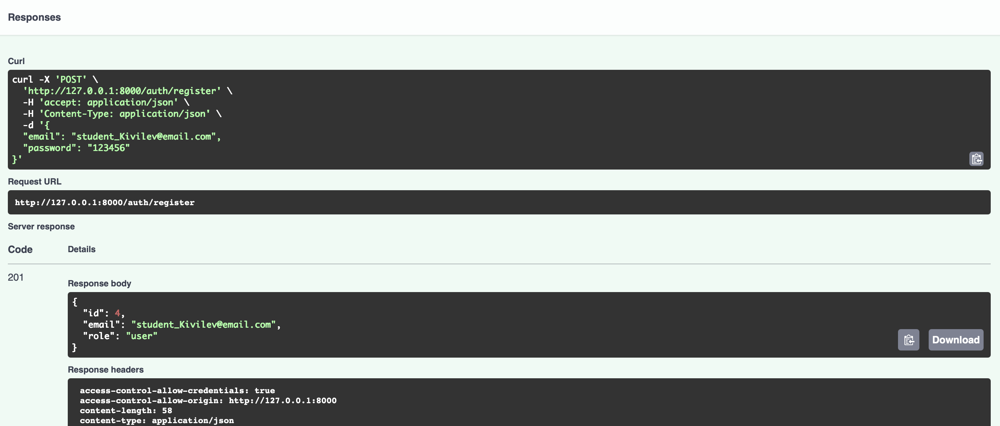
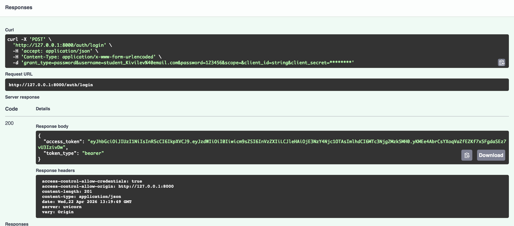
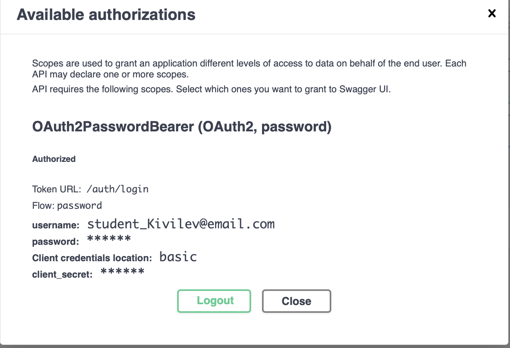
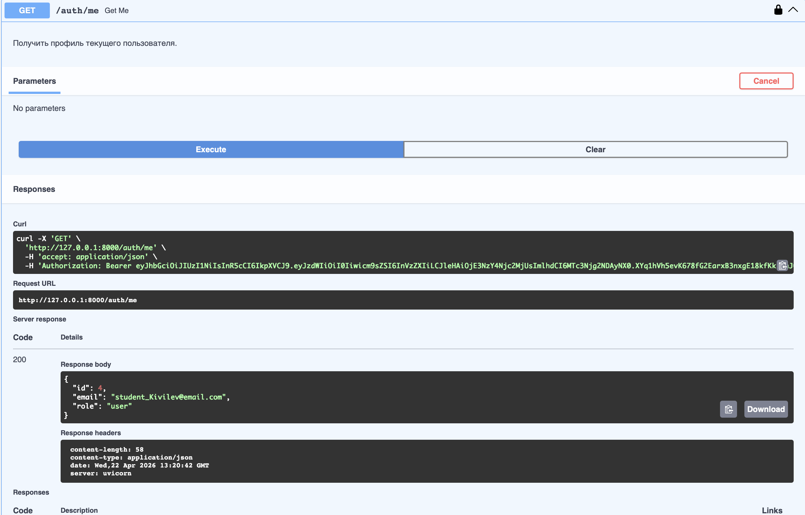
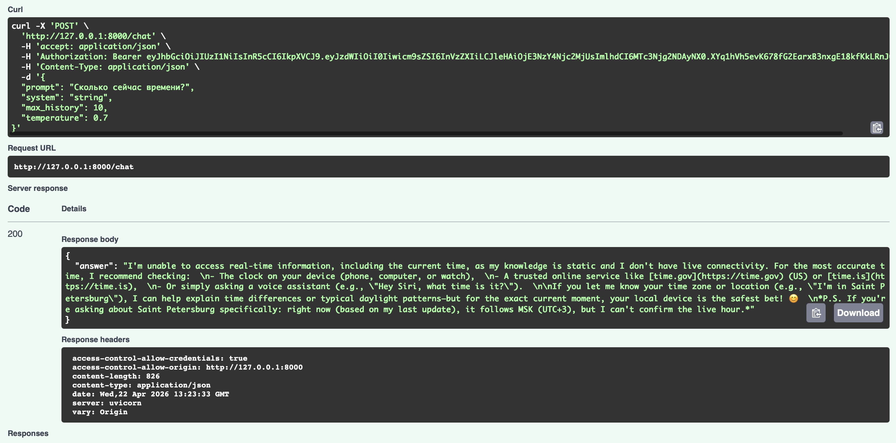
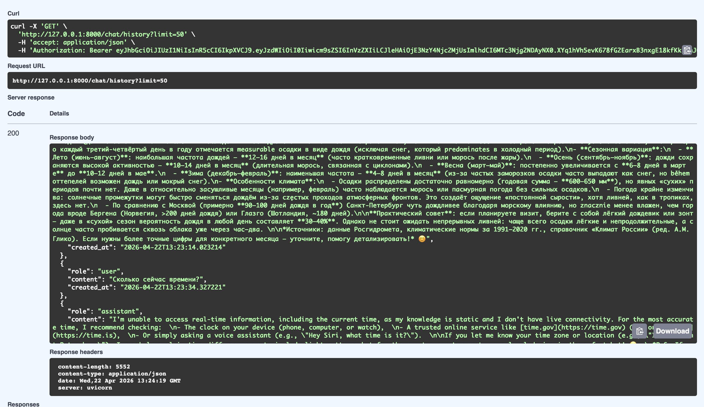
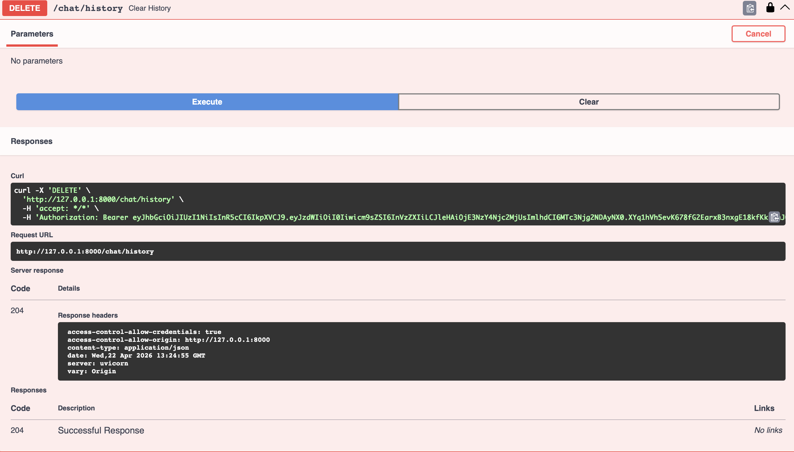
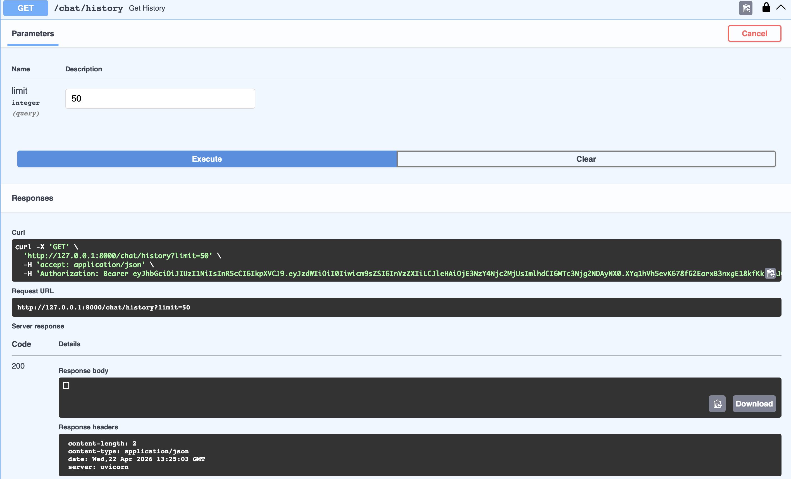
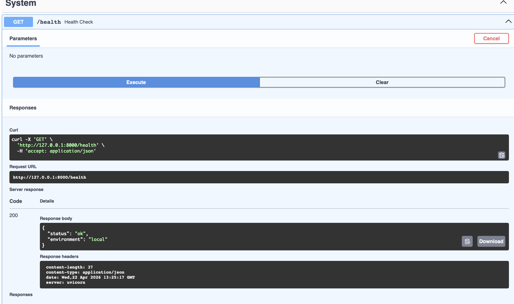

# llm-p —  API для работы с LLM через OpenRouter

Учебный проект по разработке ерверного приложения на FastAPI c интеграцией языковой модели, а так же использованием JWT-аунтефикации и SQlite 

# Установка и запуск
pip install uv

# Установка зависимостей
uv sync

# Запуск
uv run uvicorn app.main:app --reload

Swagger: **http://127.0.0.1:8000/docs**

## Демонстрация работы

### Регистрация (student_Kivilev@email.com)

### Логин и получение JWT

### Авторизация в Swagger

### Профиль пользователя

### Отправка сообщения в LLM

### История диалога

### Очистка истории

### Пустая история

### Проверка работоспособности

